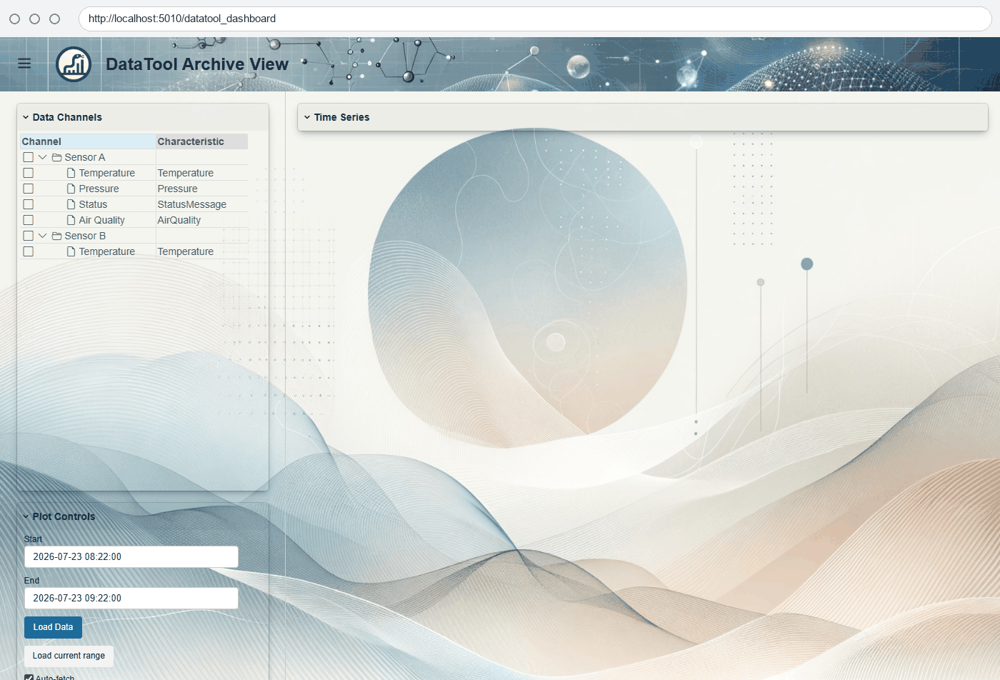
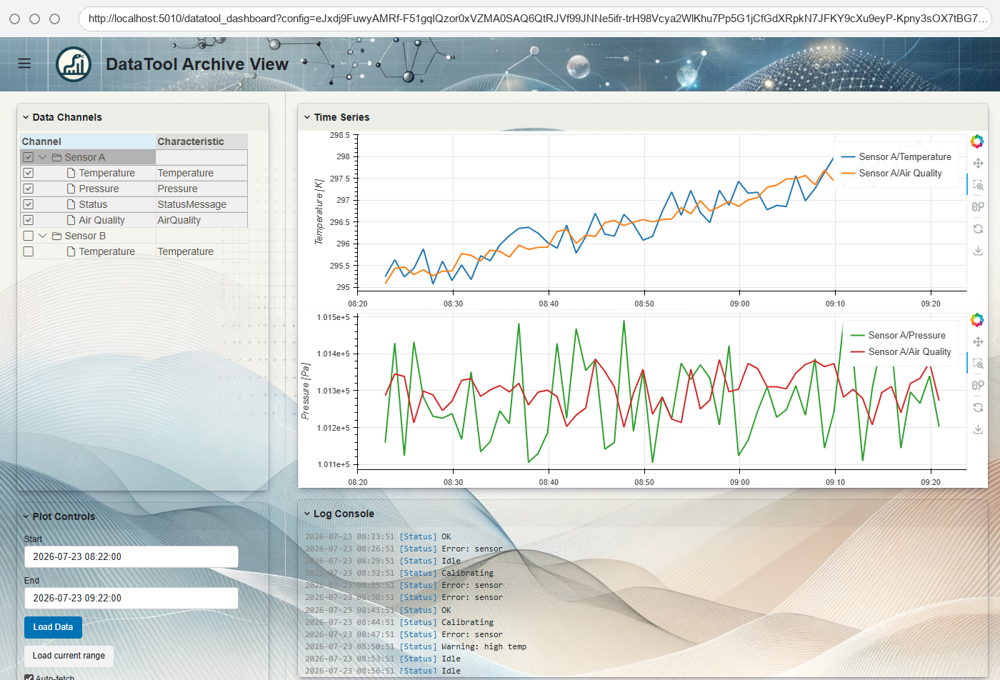
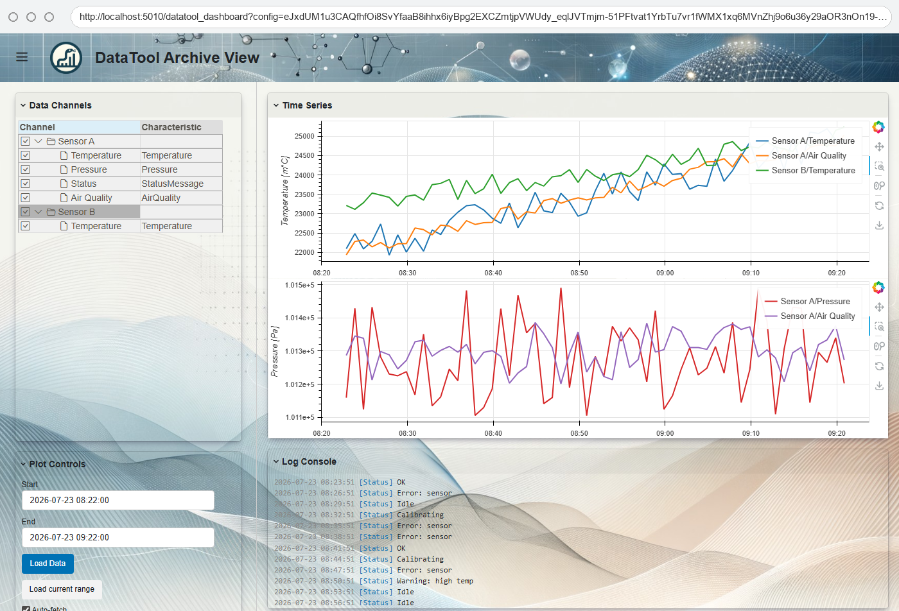
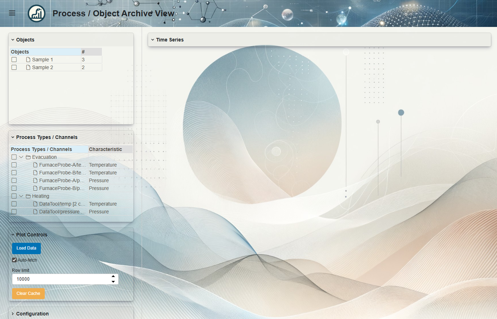
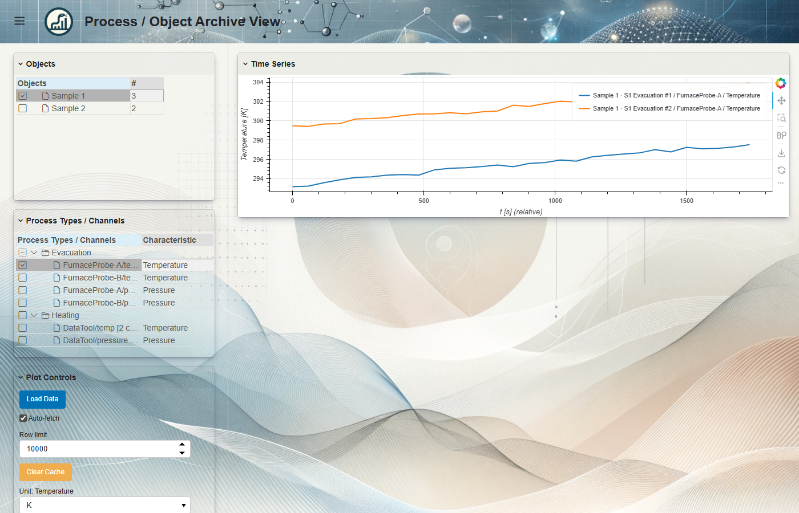
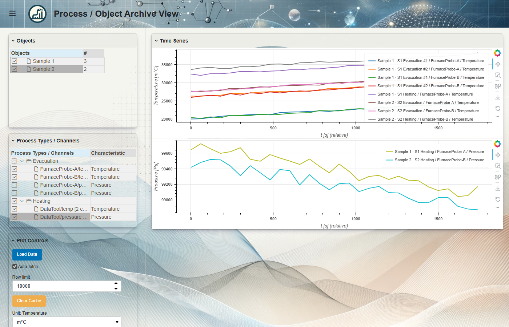

[](https://pypi.org/project/opensemantic.base/)
[](https://coveralls.io/r/OpenSemanticWorld-Packages/opensemantic.base)

# opensemantic.base

Python models and controllers for the `world.opensemantic.base` page package.

Builds on [oold-python](https://github.com/OpenSemanticWorld/oold-python) (`BaseController`, `LinkedBaseModel`, `cast()`, `_types` registry) and [opensemantic](https://github.com/OpenSemanticWorld-Packages/opensemantic-python) (`OswBaseModel`, `compute_scoped_uuid`).

## Overview

- **Auto-generated Pydantic models** (v1 and v2): Database, WebService, DataTool, DataChannel, Person, Organization, etc.
- **DataToolController** - generic controller for any DataTool
- **TimeSeriesDatabaseController** - SQLite and PostgREST backends for time series storage

## Architecture

```
opensemantic.base/
  _model.py            # auto-generated v2 Pydantic models (DO NOT EDIT)
  _controller_mixin.py # DataToolMixin, TimeSeriesDatabaseController mixins
  _controller.py       # v2 controllers
  __init__.py           # re-exports model + controller classes
  v1/                   # same structure for Pydantic v1
```

## DataToolController

Extends DataTool with channel management, subdevice traversal, and data archiving.

```python
from opensemantic.base import DataToolController

tool = DataToolController(
    name="sensor",
    label=[...],
    data_channels=[ch1, ch2],
    storage_locations=[db],
    auto_archive=True,  # auto-creates archive DB from storage_locations[0]
)

tool.get_all_channels()       # recursive across subdevices
tool.get_channel_owner(ch)    # find which device owns a channel
tool.to_json()                # only model fields (controller fields stripped)
```

### Auto-archive from storage_locations

When `auto_archive=True` and no explicit `archive_database` is set, the controller auto-creates a `LocalTimeSeriesDatabaseController` from the first `storage_locations` entry (resolved via oold backend).

### Typed read/write

Channels with a `characteristic` IRI enable typed serialization:

```python
# Write: converts to base unit, strips defaults for compact storage
await tool.store_typed_data(DataToolMixin.StoreTypedDataParams(
    tool_osw_id=tool.get_osw_id(),
    rows=[DataToolMixin.TypedDataRow(ts=now, channel=ch, value=Temperature(value=300.0))],
))

# Read: resolves characteristic class via oold's _types registry
results = await tool.read_typed_data(DataToolMixin.ReadTypedDataParams(
    tool_osw_id=tool.get_osw_id(), channel=ch,
))
# results[0] is a Temperature instance with defaults restored
```

### Subobject ID auto-computation

Inline subobject `osw_id` fields are auto-prefixed with the parent's osw_id:

```
Parent:  OSW<parent_uuid>
Channel: OSW<parent_uuid>#OSW<channel_uuid>
```

Fields with `range` in json_schema_extra are references to separate entities and are not prefixed.

### Unloaded characteristic warning

On init, DataToolController checks if channel characteristic IRIs are present in oold's `_types` registry. Missing entries produce a warning with guidance to import the corresponding package.

## TimeSeriesDatabaseController

Abstract base for time series storage, with SQLite and PostgREST implementations.

```python
from opensemantic.base import LocalTimeSeriesDatabaseController

db = LocalTimeSeriesDatabaseController(name="archive", label=[...], db_path="./data.sqlite")
await db.create_tool(params)
await db.write_tool_channel_raw(params)
await db.read_tool_channel_raw(params)
```

## DataToolView (Dashboard UI)

Interactive dashboard for visualizing archived time series data from DataToolControllers.

Features:
- Wunderbaum TreeGrid for channel selection with characteristic metadata
- Stacked Bokeh plots grouped by characteristic (temperature, pressure, etc.)
- Unit conversion via dropdown (e.g. K to C, Pa to hPa)
- Composite channel splitting (e.g. AirQuality into temperature + pressure sub-plots)
- Text channel log console with timestamped entries
- Configurable via JsonEditor (grouping, auto-fetch, row limit, cache)



*Interactive demo: channel selection, plotting, unit switching*



*Channel selection with stacked plots grouped by characteristic*


*Unit conversion via dropdown (K to C)*



*Text channel log console with timestamped entries*

```python
from opensemantic.base.view import DataToolView
from opensemantic.base.view._config import DashboardConfig, PlotConfig

view = DataToolView(
    controllers=[ctrl],
    config=DashboardConfig(lang="en", plot=PlotConfig(auto_fetch=True)),
    title="My Dashboard",
)
view.servable()  # for panel serve
```

See [examples/datatool_dashboard.py](examples/datatool_dashboard.py) for a full working example.

To regenerate the screenshots after UI changes, see [docs/generate_screenshots.py](docs/generate_screenshots.py).

## ProcessObjectView (Process/Object Dashboard UI)

Where `DataToolView` is centered on data tools, `ProcessObjectView` is centered
on the **objects** (samples, specimens, ... - any `Item`) that pass through
processes. It answers *"how did measurement X compare across the runs my objects
went through?"* by overlaying repeated runs on a common, time-normalized axis.


*Pick objects (tree 1) and a channel under a process type (tree 2); each run is
overlaid from t=0.*

Two trees drive the plot:

1. **Objects** - the `Item` instances to compare.
2. **Process types -> channels** - for each process type the objects went
   through, the channels of the data tools used in those runs.

Tree 2 is **aggregated for selection only** (tick once instead of ticking the
same channel on every run and tool). The aggregation is **co-presence aware**:

- data tools of the same type that run **together** in a process stay as
  **separate** entries (distinct measurement points);
- data tools that only ever appear in **different** runs are treated as drop-in
  replacements and **merged** into one `… [n channels]` entry (the actual
  channels are listed in its tooltip).



*Evacuation ran both probes together (separate per-instance entries); Heating
swapped the probe between runs (merged `DataTool/… [2 channels]` entries).*

Selecting an object + a channel entry plots **every real channel that object has
data on** - fanning out across process runs and co-present tools. Each line is
normalized to its own run (first data point at t=0, x-axis in seconds), grouped
by characteristic, and gets a distinct legend entry
(`object / process / data tool / channel`).



*One channel selection fans out to two runs of the same sample, overlaid from
t=0 for comparison.*



*Adding `Heating/DataTool/temp` and `…/pressure` on top of the Evacuation
selection overlays both processes, grouped into separate Temperature and Pressure
plots; the merged Heating entries resolve to probe A for Sample 1 and probe B for
Sample 2 (drop-in replacements compared across objects).*

```python
from opensemantic.base.view import ProcessObjectView
from opensemantic.base.view._config import DashboardConfig

view = ProcessObjectView(
    objects=objects,        # list[Item]
    processes=processes,    # list[Process] (filtered to those with start+end
                            # time and >=1 DataTool whose data you can load)
    controllers=controllers,  # list[DataToolController], matched to process tools
    config=DashboardConfig(lang="en"),
    title="Process / Object Archive View",
)
view.servable()  # for panel serve
```

`DataToolView` and `ProcessObjectView` share their plot/unit/config machinery via
`BaseDataView`, and both support `embeddable=True` (exposing `sidebar_cards` /
`main_cards`) so a host app can combine them.

See [examples/process_dashboard.py](examples/process_dashboard.py) for a full
working example, and
[docs/generate_process_screenshots.py](docs/generate_process_screenshots.py) to
regenerate these screenshots.

## Installation

```bash
pip install opensemantic.base            # models only
pip install opensemantic.base[controller] # + aiosqlite, postgrest
pip install opensemantic.base[view]       # + panel, bokeh, panelini, pint
```

## Testing

```bash
pytest tests/test_controller.py
```

PostgREST integration tests require a running [pgstack](https://github.com/opensemanticworld/pgstack) instance. To enable them:

1. Start pgstack: `docker compose -f docker-compose.yml -f docker-compose.example-tsdb.override.yml up -d`
2. Copy `tests/.env.example` to `tests/.env` and fill in `TEST_PGRST_URL` and `TEST_PGRST_JWT_SECRET`
3. Run tests - PostgREST tests are skipped unless both env vars are set
